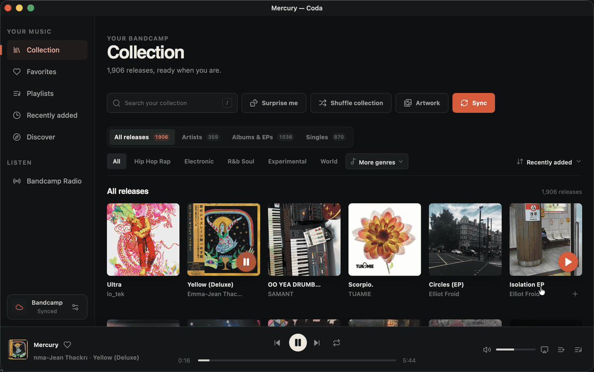

# Coda

[](https://github.com/iheanyi/coda-bandcamp/actions/workflows/cross-platform.yml)
[](LICENSE)

A fast, cross-platform desktop player for your Bandcamp collection.

Coda adds the listening experience Bandcamp's website is missing: a persistent
queue, session restore, library navigation, playlists, favorites, Radio,
Discover, and Last.fm scrobbling in a focused native app.



> [!IMPORTANT]
> Coda is pre-release software. There are no packaged releases yet, so it must
> currently be built from source. Bandcamp's Subsonic service is also in beta.

## Highlights

- Browse your collection by release, artist, album, single, genre, or recency.
- Use Surprise Me for one weighted track or a complete album without loading
  every release in the collection.
- Queue, reorder, shuffle, search, and resume playback across app restarts.
- Sync album stars through Bandcamp's Subsonic service and reconcile its
  sometimes-delayed track stars as albums load or Favorites refreshes, while
  keeping Radio favorites device-local and managing Bandcamp-synced playlists.
- Explore Bandcamp Discover and complete Bandcamp Radio show archives.
- See chapter-aware Radio metadata and seek through broadcast tracklists.
- Scrobble library tracks and eligible Radio chapters with Last.fm.
- Control playback from the system tray and use AirPlay on supported macOS
  WebKit hosts.
- Store Bandcamp and Last.fm account credentials in the operating system vault.

## Build from source

### Prerequisites

- [Node.js `^20.19.0` or `>=22.12.0`](https://nodejs.org/)
- [Rust stable](https://rustup.rs/)
- The [Tauri 2 prerequisites](https://v2.tauri.app/start/prerequisites/) for
  your operating system

```sh
git clone https://github.com/iheanyi/coda-bandcamp.git
cd coda-bandcamp
npm ci
npm run dev
```

`npm run dev` opens the desktop app with frontend hot reload and automatic Rust
rebuilds.

On macOS, the command packages and launches
`src-tauri/target/debug/bundle/macos/Coda Dev.app`. The development flavor uses
`com.coda.bandcamp.dev`, so macOS can discover it independently from an
installed production build while Vite and Tauri continue to provide hot
reloading. No local signing certificate is required: Coda uses the optional
`Coda Local Development` identity when it exists and otherwise signs the app
ad hoc.

### Unattended macOS native testing

Maintainers can build an optimized, packaged app for local automation without
giving the production bundle an unstable ad-hoc signature:

```sh
npm run desktop:build:automation
open "src-tauri/target/release/bundle/macos/Coda Dev.app"
```

This command requires the local `Coda Local Development` code-signing identity.
It fails before building when that identity is unavailable; set
`CODA_AUTOMATION_CODESIGN_IDENTITY` only to select a different installed
identity. The resulting app deliberately reuses the isolated `Coda Dev`
identifier and app-data profile, has release updating disabled, creates no
updater artifact, and is not for distribution. Ordinary `npm run dev` uses the
same non-updating profile; production desktop builds retain the signed updater.

macOS may request Keychain approval once for this signed `Coda Dev` identity.
Choose **Always Allow** for access to the saved Bandcamp Subsonic credential. Later
automation rebuilds retain the same designated requirement, so they do not
need another approval unless the signing certificate changes. The build does
not place Bandcamp credentials in environment variables, logs, source files,
or app data; authenticated operations continue to use the system Keychain.

Unlike this explicit automation build, ordinary `npm run dev` remains portable:
it uses `Coda Local Development` when available and falls back to ad-hoc signing
when it is not.

To create a native installer for the current platform:

```sh
npm run desktop:build
```

Tauri produces Windows installers on Windows, macOS bundles on macOS, and Linux
packages on Linux.

For local development with Last.fm enabled, copy `.env.example` to either the
gitignored `.env` or `.env.local`, fill in the values, and authorize the project
environment once:

```sh
cp .env.example .env.local
direnv allow
```

The checked-in `.envrc` loads `.env` first and `.env.local` second, so either
file works and machine-local values take precedence. After that, restart
`npm run dev` so Rust recompiles with the Last.fm credentials.

For a signed local build, keep the required build credentials in `.env` and
run:

```sh
npm run desktop:build:local
```

The local build command also loads `.env` explicitly before Rust compiles, so
the compile-time Last.fm credentials and Tauri updater signing credentials
reach the native build even outside a direnv-enabled shell. Do not commit
`.env` or `.env.local`.

## Connect Bandcamp

1. Open **Settings** in Coda and choose **Connect**.
2. Open [Bandcamp Fan Settings](https://bandcamp.com/settings?pane=fan).
3. Generate a separate Subsonic username and password.
4. Enter those generated credentials in Coda.

Coda never asks for your normal Bandcamp password. It only connects to
Bandcamp's official HTTPS Subsonic endpoint, and it stores the generated
credentials in Windows Credential Manager, macOS Keychain, or Linux Secret
Service.

## Last.fm

Last.fm support uses its desktop authorization flow and never collects a
Last.fm password. Local builds enable the integration when these environment
variables are present at build time:

```text
CODA_LASTFM_API_KEY
CODA_LASTFM_SHARED_SECRET
```

For the current PowerShell session:

```powershell
$env:CODA_LASTFM_API_KEY = "your-api-key"
$env:CODA_LASTFM_SHARED_SECRET = "your-shared-secret"
npm run dev
```

The Last.fm session key created after authorization is stored in the operating
system credential vault.

## Releasing

Maintainers can publish a stable release without editing version files:

1. Open **Actions** in GitHub and select the **Release** workflow.
2. Choose **Run workflow** on `main`.
3. Select `patch`, `minor`, or `major`, then run it.

If no stable release tag exists yet, the first run publishes the current
manifest version. Later runs calculate the next version from the latest stable
tag, update every JavaScript, Tauri, and Rust manifest, commit the synchronized
versions to `main`, and create the tag. The same run builds all supported
platforms, verifies the signed updater metadata, and publishes the GitHub
release.

If a platform job fails transiently, use **Re-run failed jobs** on the same
workflow run. A superseded run will refuse to replace a newer release as
latest. An exact `vX.Y.Z` tag on `main` whose version already matches every
manifest remains available as an emergency release trigger.

## Technology

Coda uses [Tauri 2](https://v2.tauri.app/) and Rust for native integration,
credential handling, persistence, and the network security boundary. The
interface is React 19 and TypeScript, built with Vite. TanStack Query manages
remote server state, while TanStack Virtual keeps large libraries responsive.

The renderer never receives stored account passwords. Signed media URLs are
short-lived and are not written to the persistent player snapshot. See
[SECURITY.md](SECURITY.md) for the complete security model.

## Quality checks

```sh
npm test
npm run test:automation-build
npm run test:coverage
npm run build
cargo test --manifest-path src-tauri/Cargo.toml
cargo clippy --manifest-path src-tauri/Cargo.toml --all-targets -- -D warnings
```

CI runs the frontend and automation-profile suites, production renderer build,
Rust tests, Clippy, and native Tauri builds on Windows, macOS, and Ubuntu. The
automation-profile suite also exercises the local signing runner's stable,
missing, duplicate, and ad-hoc identity paths where a POSIX shell is available.

## Contributing

Issues and pull requests are welcome. Before changing behavior, read
[AGENTS.md](AGENTS.md) for the architecture, security boundaries, platform
expectations, and repository conventions.

Please include tests for behavior changes and run the relevant quality checks
above before opening a pull request. Report vulnerabilities privately according
to [SECURITY.md](SECURITY.md), not in a public issue.

## License

Coda is available under the [MIT License](LICENSE).

Coda is an independent project and is not affiliated with or endorsed by
Bandcamp or Last.fm.
